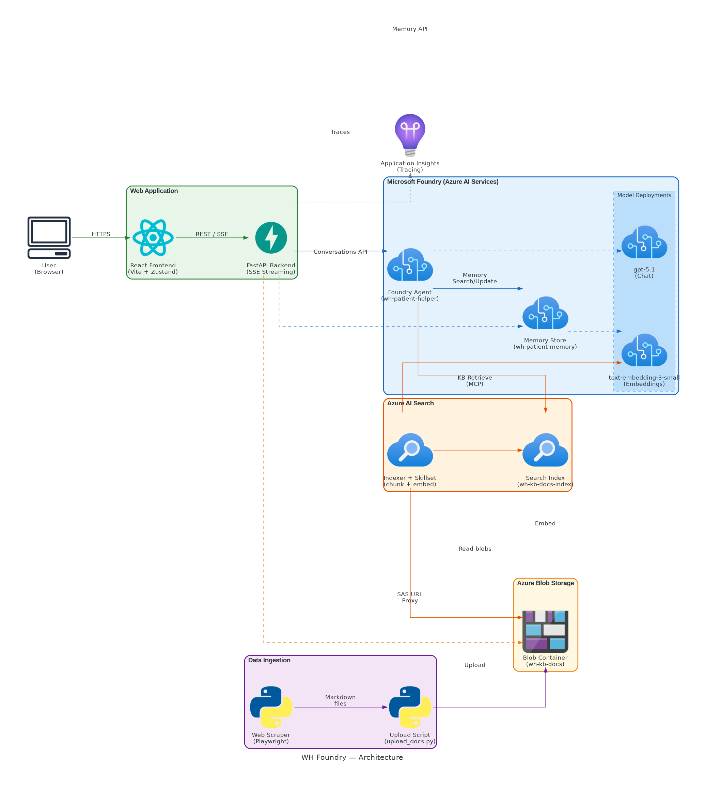
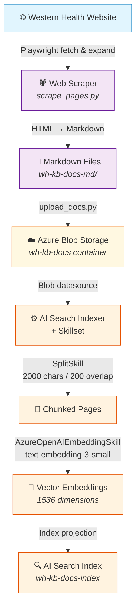

# Architecture — WH Foundry IQ Demo

## Overview

**WH Foundry** is an end-to-end demo application that combines Azure AI Foundry, Azure AI Search, and Azure Blob Storage to build a conversational AI assistant for **Western Health** patients and visitors. The assistant can answer questions about hospital services, locations, patient logistics, and more — grounded in a knowledge base of scraped web content.

Key capabilities:

- **Web scraping pipeline** — Playwright-based scraper converts hospital web pages into Markdown, uploads to Blob Storage, and indexes them via Azure AI Search with vector embeddings.
- **Foundry agent with memory** — A hosted agent (via Azure AI Foundry) uses a knowledge base (MCP connection to AI Search), a **memory store** (for user preferences), and web search.
- **React + FastAPI web app** — A full-featured chat UI with SSE streaming, source document viewing, memory management, and three route modes.
- **Observability** — OpenTelemetry tracing exported to Application Insights for end-to-end visibility.

## High-Level Architecture

## Data Ingestion Pipeline

### 1. Web Scraping (`scrape_pages.py`)

- Uses **Playwright** (headless Chromium) to fetch pages.
- Expands collapsed sections, accordions, and tabs via JavaScript injection.
- Strips navigation, headers, footers, and boilerplate via configurable CSS selectors (defined in `scrape-config.yaml`).
- Converts cleaned HTML to **Markdown** using `markdownify` + `BeautifulSoup`.
- Saves `.md` files locally to `wh-kb-docs-md/`.

### 2. Upload to Blob Storage (`upload_docs.py`)

- Uploads all `.md` files to Azure Blob Storage container `wh-kb-docs`.
- Supports `--clean` mode (delete all existing blobs first) and `--dry-run`.
- Uses `DefaultAzureCredential` for authentication.
- Sets content type to `text/markdown; charset=utf-8`.

### 3. AI Search Indexing

The search index pipeline is configured via JSON definitions in `infra/search-config/`:

| Component      | Name                     | Description |
|----------------|--------------------------|-------------|
| **Datasource** | `wh-kb-docs-datasource`  | Azure Blob datasource pointing at `wh-kb-docs` container (managed identity auth) |
| **Skillset**   | `wh-kb-docs-skillset`    | Two skills: **SplitSkill** (chunk into 2000-char pages with 200-char overlap) → **AzureOpenAIEmbeddingSkill** (1536-dim vectors via `text-embedding-3-small`) |
| **Index**      | `wh-kb-docs-index`       | Fields: `uid`, `snippet_parent_id`, `blob_url`, `snippet` (searchable text), `snippet_vector` (1536-dim vector) |
| **Indexer**    | `wh-kb-docs-indexer`     | Connects datasource → skillset → index, daily schedule, maps `metadata_storage_path` → `blob_url` |

## Agent & Chat

### Foundry Agent (`setup_agent.py`)

The agent **`wh-patient-helper`** is created via the Azure AI Projects SDK with three tools:

| Tool | Type | Description |
|------|------|-------------|
| **Knowledge Base** | MCP connection | Connects to AI Search via a knowledge base endpoint; auto-approved for `knowledge_base_retrieve` |
| **Memory Store** | `MemorySearchPreviewTool` | Searches/updates the memory store for user preferences (scoped per user) |
| **Web Search** | `web_search_preview` | Supplementary web search for information not in the knowledge base |

**Agent configuration:**

- **Model:** `gpt-5.1` (configurable via `AGENT_MODEL`)
- **Instructions:** Scoped to Western Health patient/visitor queries only
- **Memory store:** `wh-patient-memory` with configurable update delay (10s demo / 300s production)

### Memory Store (Microsoft Foundry)

The memory store is a **Microsoft Foundry managed service** that persists user preferences and context across conversations. It is created and managed within the Foundry project.

| Property | Value |
|----------|-------|
| **Name** | `wh-patient-memory` |
| **Type** | `MemoryStoreDefaultDefinition` (Foundry-managed) |
| **Chat model** | `gpt-5.1` (for summarization) |
| **Embedding model** | `text-embedding-3-small` |
| **Chat summary** | Enabled |
| **User profile** | Enabled |
| **Scope isolation** | Memories scoped per `MEMORY_SCOPE` value (e.g. `demo_user`) — each scope has independent memory |
| **Update debounce** | Configurable delay (`MEMORY_UPDATE_DELAY`) before memory updates — 10s for demo, 300s for production |

**Memory types:**

- **User profile** — Location/suburb, preferred hospital, language, answer style (concise/detailed/dot points), medical context
- **Chat summary** — Condensed summaries of past conversation turns

**Scope isolation** ensures that different users (or demo sessions) have fully independent memories. The `delete_scope` API clears all memories for a given scope.

**Management API** (exposed via FastAPI):

| Endpoint | Method | Description |
|----------|--------|-------------|
| `/api/memories` | `GET` | List all memories for the current scope |
| `/api/memories` | `DELETE` | Delete all memories for the current scope |

### Conversations API

The Foundry agent uses the **Conversations API** (`openai_client.conversations.create()` / `openai_client.responses.create()`) which provides:

- Persistent conversation threads (server-managed)
- Streaming responses via the Responses API
- Automatic tool invocation (knowledge base, memory, web search)

## Web Application

### Backend — FastAPI (`web/api/server.py`)

| Feature | Implementation |
|---------|----------------|
| **Framework** | FastAPI with Uvicorn |
| **Streaming** | SSE via `sse-starlette` — streams `delta`, `citations`, `memories_used`, and `done` events |
| **Chat management** | In-memory dict mapping `chat_id` → Foundry `conversation_id` + local message history |
| **Source viewer** | Generates user-delegation SAS URLs for blob storage documents (requires `Storage Blob Delegator` + `Storage Blob Data Contributor` roles) |
| **Memory endpoints** | Proxies Foundry Memory Store `search_memories` and `delete_scope` APIs |
| **Tracing** | OpenTelemetry spans for every HTTP request + agent call, exported to Application Insights |
| **CORS** | Wide-open (`*`) for local development |

**Key endpoints:**

| Endpoint | Method | Description |
|----------|--------|-------------|
| `POST /api/chats` | POST | Create a new chat (Foundry conversation) |
| `GET /api/chats` | GET | List all chats |
| `GET /api/chats/{id}/messages` | GET | Get messages for a chat |
| `DELETE /api/chats/{id}` | DELETE | Delete a chat |
| `POST /api/chats/{id}/messages` | POST | Send message + stream response (SSE) |
| `POST /api/chats/{id}/messages/sync` | POST | Send message, get full response (non-streaming) |
| `GET /api/memories` | GET | List memories |
| `DELETE /api/memories` | DELETE | Clear all memories |
| `GET /api/source?url=...` | GET | Fetch source document content via SAS proxy |
| `GET /api/health` | GET | Health check |

### Frontend — React + TypeScript (`web/src/`)

| Aspect | Details |
|--------|---------|
| **Framework** | React 19 + TypeScript |
| **Build tool** | Vite 8 |
| **State management** | Zustand (two stores: `chatStore`, `memoryStore`) |
| **Routing** | React Router v7 with three modes |
| **Markdown rendering** | `react-markdown` + `remark-gfm` |
| **Styling** | CSS Modules |

**Route modes:**

| Route | Page | Description |
|-------|------|-------------|
| `/` | `FullAppPage` | Full-featured chat app with sidebar, memory panel, and source viewer |
| `/widget` | `WidgetPage` | Floating chat widget (embeddable bubble) |
| `/embed` | `EmbedPage` | Minimal iframe-embeddable chat panel |

**Components:**

| Component | Purpose |
|-----------|---------|
| `Sidebar` | Chat list, new chat button, chat deletion |
| `ChatPanel` | Main chat interface — message input, streaming display, citation links |
| `MemoryPanel` | View and clear agent memories |
| `SourceModal` | Modal viewer for source documents (fetched via SAS proxy) |
| `ChatWidget` | Floating bubble widget for widget/embed modes |

## Azure Services

| Service | Resource | SKU | Purpose |
|---------|----------|-----|---------|
| **Azure Storage** | Storage Account | Standard_ZRS | Blob storage for knowledge base documents (`wh-kb-docs` container) |
| **Azure AI Search** | Search Service | Basic | Vector + semantic search index for knowledge base grounding |
| **Azure AI Services (Foundry)** | Cognitive Services Account | S0 | AI model hosting, agent runtime, memory store, project management |
| **Azure AI Foundry Project** | Project (`mydemos`) | S0 | Foundry project connecting AI Services + AI Search |
| **Application Insights** | App Insights + Log Analytics | PerGB2018 | OpenTelemetry trace collection and agent observability |

## Model Deployments

| Model | Deployment Name | SKU | Capacity | Purpose |
|-------|----------------|-----|----------|---------|
| `text-embedding-3-small` | `text-embedding-3-small` | Standard | 120 | Embeddings for AI Search skillset + memory store |
| `gpt-4.1` | `gpt-4.1` | GlobalStandard | 50 | Chat model (alternative) |
| `gpt-5.1` | `gpt-5.1` | GlobalStandard | 120 | Primary agent chat model + memory summarization |
| `gpt-5.2` | `gpt-5.2` | GlobalStandard | 150 | Chat model (latest) |

## RBAC Role Assignments

| Source Principal | Target Resource | Role | Purpose |
|-----------------|-----------------|------|---------|
| AI Search (managed identity) | Storage Account | **Storage Blob Data Reader** | Indexer reads blobs from storage |
| AI Search (managed identity) | AI Services Account | **Cognitive Services User** | Indexer calls embedding model |
| Current User | Storage Account | **Storage Blob Data Contributor** | Upload/manage documents |
| Current User | Storage Account | **Storage Blob Delegator** | Generate user-delegation SAS URLs for source viewer |
| Current User | AI Services Account | **Cognitive Services User** | Call AI models, manage agents |
| AI Services (self — system identity) | AI Services Account | **Cognitive Services User** | Memory store calls embedding model on the same account |
| Project (managed identity) | AI Services Account | **Cognitive Services User** | Memory store authenticates and calls models (chat + embedding) |

## Search Index Configuration

| Setting | Value |
|---------|-------|
| **Vector algorithm** | HNSW (`m=4`, `efConstruction=400`, `efSearch=500`, `cosine` metric) |
| **Compression** | Scalar quantization (`int8`) with rescoring enabled (oversampling=4, preserveOriginals) |
| **Vectorizer** | Azure OpenAI (`text-embedding-3-small`, 1536 dimensions) |
| **Semantic config** | `wh-kb-docs-semantic-configuration` — prioritized content field: `snippet` |
| **Index projection** | `skipIndexingParentDocuments` — only child chunks are indexed |
| **Chunking** | SplitSkill — 2000 chars/page, 200 chars overlap |

## Source Document Viewing

The chat UI includes a **source viewer** that lets users inspect the original documents cited by the agent:

1. Agent response includes citation URLs pointing to Azure Blob Storage.
2. Frontend sends the blob URL to `GET /api/source?url=...`.
3. Backend generates a **user-delegation SAS URL** (time-limited, read-only, 5-minute expiry).
4. Backend fetches the document content via the SAS URL and returns it to the frontend.
5. Frontend renders the Markdown content in a `SourceModal`.

**Required roles** for SAS URL generation:
- `Storage Blob Data Contributor` — read access to blobs
- `Storage Blob Delegator` — permission to create user-delegation keys

## Web Application Stack

| Layer | Technology | Details |
|-------|-----------|---------|
| **Backend** | FastAPI + Uvicorn | Python 3, SSE streaming via `sse-starlette` |
| **Frontend** | React 19 + TypeScript | Vite 8 build, CSS Modules |
| **State** | Zustand | Two stores: `chatStore` (chats/messages), `memoryStore` (agent memories) |
| **Styling** | CSS Modules | Per-component `.module.css` files |
| **Auth** | `DefaultAzureCredential` | Backend authenticates to all Azure services via managed identity / CLI |
| **Routing** | React Router v7 | Three modes: full app (`/`), widget (`/widget`), embed (`/embed`) |
| **Observability** | OpenTelemetry | Auto-instrumented FastAPI + manual spans, Azure Monitor exporter |

## Observability

- **Tracing** is configured in `tracing.py` using OpenTelemetry SDK.
- Traces export to **Application Insights** when `APPLICATION_INSIGHTS_CONNECTION_STRING` is set; otherwise traces go to console.
- FastAPI is auto-instrumented with `opentelemetry-instrumentation-fastapi`.
- Custom spans track: chat session creation, agent calls, citation extraction, memory operations.
- Azure SDK tracing is enabled via `azure-core-tracing-opentelemetry`.

## Resources

- [Azure AI Foundry documentation](https://learn.microsoft.com/azure/ai-studio/)
- [Azure AI Projects SDK (Python)](https://learn.microsoft.com/python/api/overview/azure/ai-projects-readme)
- [Azure AI Search — Vector search](https://learn.microsoft.com/azure/search/vector-search-overview)
- [Azure AI Search — Integrated vectorization](https://learn.microsoft.com/azure/search/vector-search-integrated-vectorization)
- [Azure AI Search — Semantic ranking](https://learn.microsoft.com/azure/search/semantic-search-overview)
- [Azure Blob Storage — User delegation SAS](https://learn.microsoft.com/azure/storage/blobs/storage-blob-user-delegation-sas-create-cli)
- [Azure AI Foundry — Memory Store](https://learn.microsoft.com/azure/ai-foundry/concepts/memory)
- [OpenTelemetry Python SDK](https://opentelemetry.io/docs/languages/python/)
- [FastAPI documentation](https://fastapi.tiangolo.com/)
- [Zustand state management](https://zustand.docs.pmnd.rs/)
